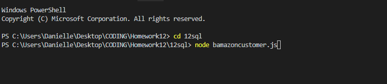
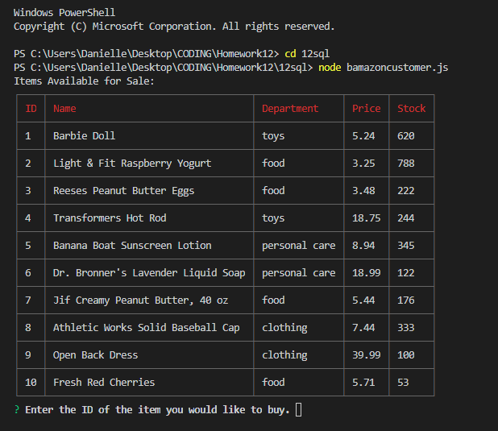
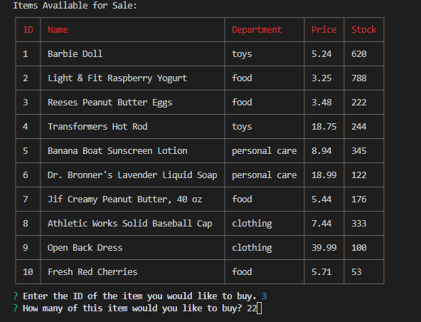
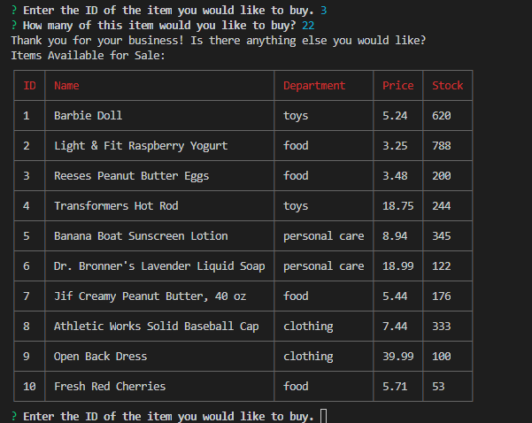
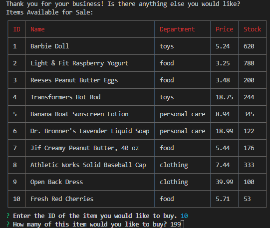
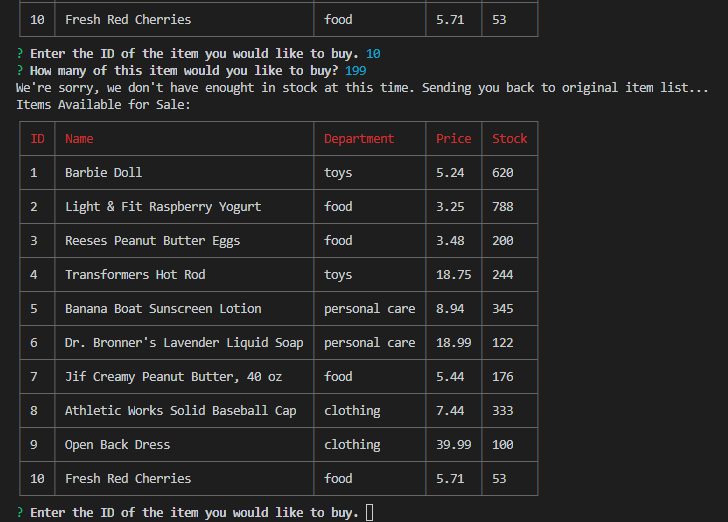

# 12sql

* * First, create your database. Just in case, I'm starting with the "drop database if exist" function, then "CREATE DATABASE", then "USE."

* * Now use CREATE TABLE to create a table named "products". 

* * Our columns are item_id, product_name, department_name, price, and stock_quantity. This will represent the inventory.

* * Insert data into the table with INSERT INTO with the coulmn values product_name, department_name, price and stock_quantity.

* * Then create a Node application called bamazonCustomer.js

* * First define variables  "mysql" "table" and "inquirer." Then define the "connection" variable and assign host, password, etc.

* * Function that pushes table.

* * Use Inquirer.Prompt to ask the user for input.

* * 
* * 
* * 
* * 
* * 
* * 